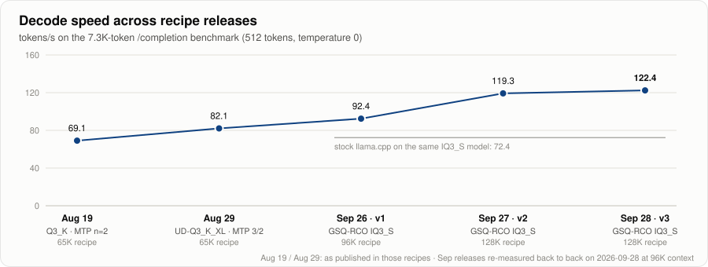
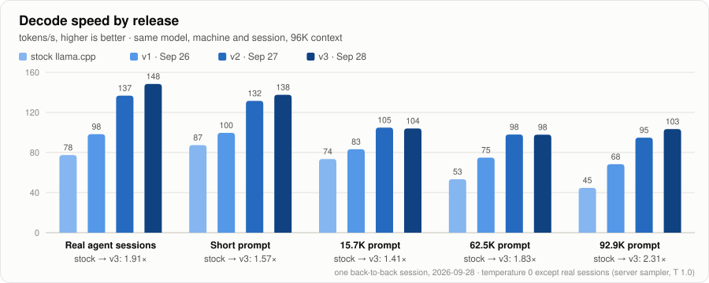
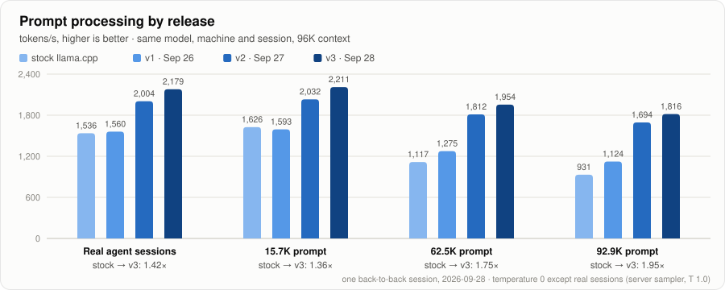
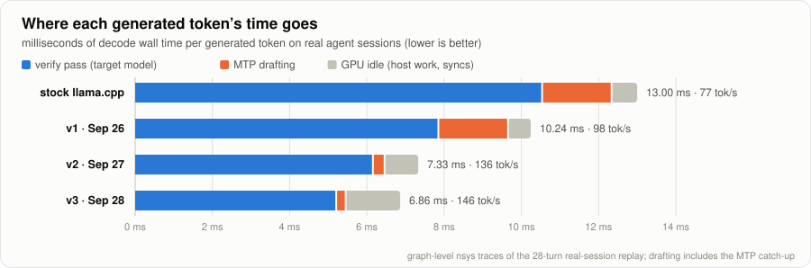

# Qwen3.8 27B abliterated on a 5070 Ti: 128K context, adaptive MTP, custom CUDA kernels v3

Verified on 2026-09-28. This is the current one-card recipe from the same workstation as the earlier versions. It runs Huihui's GSQ-RCO IQ3_S quant with its embedded MTP head at up to **131,072 tokens of context** on a 16 GB RTX 5070 Ti, with a local llama.cpp patch ([`cuda-kernels.patch`](cuda-kernels.patch), v3) that rewrites most of the decode and prefill hot path for this model and GPU.

Same weights, previous recipe's build (v2) vs this one (v3), run back to back:

| | v2 (2026-09-27) | **v3** | change |
|---|---:|---:|---:|
| decode, **real agent sessions** (28 regenerated turns, production sampler) | 136.6 tok/s | **147.2** | **+7.8%** |
| prefill, real agent sessions | 2,005 tok/s | **2,177** | +8.6% |
| decode, 15.7K / 62.5K / 92.9K prompt (temperature 0) | 104.5 / 97.8 / 94.7 | **109.6 / 99.7 / 100.2** | +5% / +2% / +6% |
| prefill, 15.7K / 62.5K / 92.9K prompt | 2,028 / 1,812 / 1,694 | **2,200 / 1,949 / 1,814** | +8% / +8% / +7% |
| time to first token, 92.9K prompt | 55.0 s | **51.3 s** | −7% |
| llama-server peak VRAM at 96K / 128K | 14,286 / ~14,930 MiB | **13,898 / 14,530 MiB** | −390 / −400 MiB |

At 128K a 128,794-token prompt prefills at 1,680 tok/s and then decodes at 93 tok/s. Output quality is unchanged within noise ([Numerical checks](#numerical-checks)).

For reference, v2 was +26–39% faster than v1 on decode and up to +51% on prefill ([previous README](https://github.com/feveromo/recipes-qwen3.8-27b-5070ti/blob/f249515/README.md)). Against stock llama.cpp on the same weights, v3 decodes real agent sessions 1.9× as fast and a 92.9K-token prompt 2.3× as fast ([Performance history](#performance-history)).

The biggest single finding of this round is not a kernel: **upstream llama.cpp's programmatic dependent launch (PDL) made this setup randomly ~7% slower**, see [PDL](#pdl-is-off-by-default). The v3 patch turns it off by default.

The usual caveats hold: this is a 16 GB configuration with little spare VRAM, and the patch is not upstream. It was written and tested only for this model on this GPU (`sm_120`). Every new kernel path checks the architecture, types and shapes it was tested for, and falls back to the v2/v1/stock code otherwise.

## Performance history

<picture>
  <source media="(prefers-color-scheme: dark)" srcset="assets/timeline-dark.svg">
  
</picture>

The first two points are the numbers published with the August recipes (different quants and an older llama.cpp). The September recipes all use the same GSQ-RCO IQ3_S weights, so they were re-measured back to back in one session on 2026-09-28 together with stock llama.cpp (`4b1a27fa0`, no patch): each build with its own recipe's launch flags (stock with v1's: MTP with 3 draft tokens, F16 draft KV), all at 96K context so every build fits. On stock llama.cpp the September model is slower than the August 29 recipe on this benchmark; the patch accounts for the whole climb since.

<picture>
  <source media="(prefers-color-scheme: dark)" srcset="assets/decode-dark.svg">
  
</picture>

<picture>
  <source media="(prefers-color-scheme: dark)" srcset="assets/prefill-dark.svg">
  
</picture>

<picture>
  <source media="(prefers-color-scheme: dark)" srcset="assets/breakdown-dark.svg">
  
</picture>

Where the time per generated token goes on the real sessions, from graph-level nsys traces of the same replay (tracing costs 1–2%, hence 146 rather than 148 tok/s for v3). The verify pass, where the full 27B model checks a batch of drafted tokens, went from 10.56 ms per token on stock to 5.23 ms on v3. MTP drafting dropped from 1.80 to 0.25 ms when v2 fused it with the reduced vocabulary. GPU idle time between graphs rose to 1.39 ms in v3, the one part that got worse, and is now the largest target after the verify pass.

The same numbers as a table (decode and prefill in tok/s):

| | stock | v1 | v2 | v3 | stock → v3 |
|---|---:|---:|---:|---:|---:|
| decode, real agent sessions | 77.5 | 98.3 | 136.7 | **148.4** | 1.91× |
| decode, short prompt (mean of 2) | 87.4 | 99.6 | 131.5 | **137.6** | 1.57× |
| decode, 15.7K prompt | 73.5 | 83.2 | **104.9** | 104.0 | 1.41× |
| decode, 62.5K prompt | 53.3 | 74.9 | **98.0** | 97.8 | 1.83× |
| decode, 92.9K prompt | 44.7 | 68.3 | 94.8 | **103.4** | 2.31× |
| decode, 7.3K `benchmark.py` (mean of 3) | 72.37 | 92.42 | 119.26 | **122.44** | 1.69× |
| prefill, real agent sessions | 1,536 | 1,560 | 2,004 | **2,179** | 1.42× |
| prefill, 15.7K prompt | 1,626 | 1,593 | 2,032 | **2,211** | 1.36× |
| prefill, 62.5K prompt | 1,117 | 1,275 | 1,812 | **1,954** | 1.75× |
| prefill, 92.9K prompt | 931 | 1,124 | 1,694 | **1,816** | 1.95× |
| time to first token, 92.9K prompt | 99.9 s | 82.8 s | 55.0 s | **51.3 s** | −49% |
| draft acceptance, real agent sessions | 0.578 | 0.597 | **0.672** | 0.609 | |

Synthetic prompts run at temperature 0 with one run each unless noted; the real-session replay uses the server's production sampler (temperature 1.0). Greedy draft acceptance moves with any numeric change, so single synthetic runs vary by a few percent between sessions (the v2/v3 tables below are from a separate session). Raw JSON: [`results/2026-09-28/history/`](results/2026-09-28/history/); the charts are generated from [`assets/history.json`](assets/history.json) by [`assets/gen_charts.py`](assets/gen_charts.py).

## Verified hardware and software

- GPU: NVIDIA GeForce RTX 5070 Ti, GB203, 16,303 MiB VRAM, compute capability 12.0
- CPU: Ryzen 7 9800X3D, 8C/16T; power profile `performance`
- RAM: 32 GB DDR5-6000
- OS: Ubuntu 26.04.1 LTS, kernel 7.0.0-31-generic
- NVIDIA driver: 610.57.04
- CUDA toolkit: 13.1.115, host compiler g++-13
- llama.cpp: build 11191, commit `4b1a27fa0eb875bbca4f6cfe936e3d65adc685c0`, plus [`cuda-kernels.patch`](cuda-kernels.patch) (SHA-256 `06606651b7d801a15f77a16526c48d0cfaa943cd39c34a7209f908057b125a94`; includes the v1 and v2 changes)
- Model repository: `huihui-ai/Huihui-Qwen3.8-27B-abliterated-GGUF`, revision `3f101cd22b7999228bbd5d79a33975414eb9758b`
- Model file: `Huihui-Qwen3.8-27B-abliterated-GSQ-RCO-IQ3_S-mtp.gguf`, 12,120,016,416 bytes, SHA-256 `eea0638e283433e27b0edbd409b552be467a75ecc777d91c51db554c0a644c19`
- Context: up to 131,072, chosen at start from free VRAM. Target KV: Q4_0 K/V. MTP draft KV: Q4_0 K/V
- Speculation: embedded MTP, adaptive 1–5 draft tokens per cycle, fused reduced-vocabulary drafting, Gumbel-coupled sampling
- Batch / ubatch: 512 / 256. Threads: 8. Parallel slots: 1

The model has 64 target layers (48 Gated DeltaNet linear-attention layers and 16 full-attention layers with 24 query heads, 4 KV heads, head size 256) plus the embedded MTP (NextN) layer. Native context is 262,144; 128K is the practical limit here with a desktop running on the same card.

## Download and verify the model

```bash
MODEL_DIR=/home/fever/Models/huihui-qwen3.8-27b-abliterated-gsq-rco-iq3s
MODEL="$MODEL_DIR/Huihui-Qwen3.8-27B-abliterated-GSQ-RCO-IQ3_S-mtp.gguf"
mkdir -p "$MODEL_DIR"
curl --location --fail --retry 5 --continue-at - \
  --output "$MODEL" \
  'https://huggingface.co/huihui-ai/Huihui-Qwen3.8-27B-abliterated-GGUF/resolve/3f101cd22b7999228bbd5d79a33975414eb9758b/Huihui-Qwen3.8-27B-abliterated-GSQ-RCO-IQ3_S-mtp.gguf?download=true'
stat -c '%s bytes' "$MODEL"
sha256sum "$MODEL"
```

Expected output:

```text
12120016416 bytes
eea0638e283433e27b0edbd409b552be467a75ecc777d91c51db554c0a644c19  .../Huihui-Qwen3.8-27B-abliterated-GSQ-RCO-IQ3_S-mtp.gguf
```

## Build the patched llama.cpp

`RECIPE` is your checkout of this repository.

```bash
RECIPE=/home/fever/Dev/recipes-qwen3.8-27b-5070ti
LLAMA=/home/fever/Dev/llama.cpp-pi2-cuda-20260928

git clone https://github.com/ggml-org/llama.cpp.git "$LLAMA"
cd "$LLAMA"
git checkout 4b1a27fa0eb875bbca4f6cfe936e3d65adc685c0
sha256sum "$RECIPE/cuda-kernels.patch"   # 06606651...25a94
git apply --check "$RECIPE/cuda-kernels.patch"
git apply "$RECIPE/cuda-kernels.patch"

cmake -S . -B build -G Ninja \
  -DCMAKE_BUILD_TYPE=Release \
  -DCMAKE_C_COMPILER=/usr/bin/cc \
  -DCMAKE_CXX_COMPILER=/usr/bin/c++ \
  -DCMAKE_CUDA_COMPILER=/usr/local/cuda-13.1/bin/nvcc \
  -DCMAKE_CUDA_HOST_COMPILER=/usr/bin/g++-13 \
  -DCUDAToolkit_ROOT=/usr/local/cuda-13.1 \
  -DCMAKE_CUDA_ARCHITECTURES=120a-real \
  -DCMAKE_C_COMPILER_LAUNCHER=ccache \
  -DCMAKE_CXX_COMPILER_LAUNCHER=ccache \
  -DGGML_CCACHE=ON \
  -DGGML_CUDA=ON \
  -DGGML_NATIVE=ON \
  -DGGML_CUDA_GRAPHS=ON \
  -DGGML_CUDA_FA=ON \
  -DGGML_CUDA_FA_ALL_QUANTS=OFF \
  '-DGGML_CUDA_FA_QUANTS=q4_0-q4_0;q8_0-q8_0;f16-f16;bf16-bf16' \
  -DGGML_CUDA_COMPRESSION_MODE=size \
  -DGGML_CUDA_NCCL=OFF \
  -DGGML_CUDA_FORCE_MMQ=OFF \
  -DGGML_CUDA_FORCE_CUBLAS=OFF \
  -DGGML_CUDA_NO_PEER_COPY=OFF \
  -DGGML_CUDA_NO_VMM=OFF \
  -DGGML_CPU=ON \
  -DGGML_CPU_REPACK=ON \
  -DGGML_OPENMP=ON \
  -DGGML_LLAMAFILE=ON \
  -DGGML_BLAS=OFF \
  -DGGML_LTO=OFF \
  -DGGML_BACKEND_DL=OFF \
  -DBUILD_SHARED_LIBS=ON \
  -DLLAMA_OPENSSL=ON \
  -DLLAMA_BUILD_UI=ON \
  -DLLAMA_USE_PREBUILT_UI=ON

cmake --build build --target llama-server llama-bench --parallel 12

LD_LIBRARY_PATH=/usr/local/cuda-13.1/lib64 ./build/bin/llama-server --version
```

The build takes about three minutes and `--version` reports `build 11191, commit 4b1a27fa0`. The configure flags are unchanged from the previous recipes; many restate defaults so the build is exactly the one measured. The patch is made against `4b1a27fa0`; on newer upstream commits expect manual merges.

To run the tests, including the cases the patch adds:

```bash
cmake --build build --target test-backend-ops test-sampling-coupled test-gdn-replay --parallel 12
LD_LIBRARY_PATH=/usr/local/cuda-13.1/lib64 ./build/bin/test-backend-ops test -b CUDA0
./build/bin/test-sampling-coupled
LD_LIBRARY_PATH=/usr/local/cuda-13.1/lib64 ./build/bin/test-gdn-replay
```

## Draft vocabulary

The fused drafting mode (`--spec-draft-vocab`) gives the MTP head a reduced lm-head: the first 16,384 token ids of a ranked vocabulary file, plus up to 8,192 rows filled with tokens seen in the current context. Two options:

- **Generic:** [`draft-vocab-generic.txt`](draft-vocab-generic.txt), ranked from public text only (the WikiText-2 training split and the llama.cpp sources, 10.7M tokens).
- **Your own (recommended):** rank tokens from what the model writes for you. [`build-draft-vocab.py`](build-draft-vocab.py) reads Pi session logs (assistant output only, rendered like the chat template) and/or plain text files, and tokenizes through a running llama-server:

```bash
python3 build-draft-vocab.py --url http://127.0.0.1:8003 \
  --pi-sessions ~/.pi/agent/sessions --out ~/.pi2/agent/draft-vocab.txt
```

The measurements in this README used a vocabulary ranked from my own coding-agent sessions (not published). On the synthetic benchmark the generic file performed the same within noise ([`results/2026-09-27/vocab-generic-v2-*.json`](results/2026-09-27/)); on your own work a personal file should accept more drafts.

## What the patch changes

**v1 and v2** (see the [previous README](https://github.com/feveromo/recipes-qwen3.8-27b-5070ti/blob/f249515/README.md) for details and measurements): Q4_0-direct flash attention; a dequantize-once multi-column quantized mat-vec; fused, reduced-vocabulary MTP drafting with a K/V-only catch-up; Gumbel-coupled sampling; Q4_0 draft KV via the MMA attention path; INT8 prefill attention; per-graph activation quantization cache and kernel fusions; pipelined prefill MMQ.

**New in v3.** A profile of v2 showed, per ~21 ms short-context cycle: the 4-token verify graph at 18.0 ms (16.2 ms of it the multi-column mat-vec at ~700 GB/s), the fused draft graph at 1.7 ms, and 1.1 ms of GPU idle. The recurrent (Gated DeltaNet) kernel wrote 4 full state snapshots per layer per cycle for rollback, ~600 MB of writes, all resident in VRAM. On real agent sessions, tool-call and code turns accepted 0.75–0.97 of drafts and hit the 3-token draft cap.

1. **Recurrent-state rollback by replay** (`src/llama-memory-recurrent.*`, `gated_delta_net.cu`, `qwen35.cpp`). Instead of snapshotting the full state after every verified token, keep one state per sequence plus a small ring buffer of recent tokens' inputs; a rollback only drops ring rows, and the next graph's GDN kernel replays the accepted ones. Outputs are bit-identical to the snapshot scheme. The recurrent buffers shrink from 576 to 156 MiB, and a 7-token draft costs +34 MiB instead of +608 MiB. `LLAMA_RS_REPLAY=0` restores snapshots.
2. **Mat-vec for 5–8 tokens** (`mmvq.cu`). The multi-column kernel is extended to 8 columns, with a per-type/shape choice among five configurations, fused gate/up for 2–8 columns including gate/up pairs of different quant types, and 8-byte activation loads. An 8-token verify graph: 31.95 → 21.89 ms; the 4-token one: 18.06 → 17.69 ms.
3. **Adaptive draft length** (`common/speculative.cpp`, fused draft graph, per-width graph cache). `--spec-draft-n-max 5 --spec-draft-adaptive` chooses 1–5 draft tokens per cycle from online estimates of acceptance and of the cost of each verify width; a per-width graph cache makes switching widths cheap. On the real-session benchmark: 3 fixed 142.2, adaptive ≤ 7 146.9, 5 fixed 148.3, **adaptive ≤ 5 150.7 tok/s** ([`draft-length-*.json`](results/2026-09-28/)).
4. **Warp-specialized prefill MMQ** (`mmq*.cuh`). For IQ2_XXS/XS/S, IQ3_XXS/S and IQ4_XS, extra warps decode the next weight tile into shared memory while the other warps run the tensor-core math, with registers rebalanced between the two roles (`setmaxnreg`); plus a cheaper MMA epilogue and three prefill fusions (SwiGLU into the down-projection's input quantization, the GDN gated norm into the ssm_out quantization, one shared quantization for gate/up). Bit-identical to v2; big prefill matmuls 6–14% faster.
5. **PDL off by default** (`common.cuh`), see below.

### PDL is off by default

Upstream llama.cpp launches kernels with programmatic dependent launch on Blackwell: a kernel's successor may start before it finishes and wait on the device. Measured on this card with graph-level timing, the 4-token verify graph of v2 came out at either 18.1 or 19.5 ms depending on the server run (bimodal, ~7% apart), and at a stable 17.9 ms with `GGML_CUDA_PDL=0`. With this round's changes the effect was larger: 18.3–20.0 ms with PDL, 17.1 ms without ([`pdl-verify-graph.json`](results/2026-09-28/pdl-verify-graph.json)). The early-launched blocks sit on SM slots that the memory-bound mat-vec kernels need. v3 therefore only enables PDL with `GGML_CUDA_PDL=1`. The INT8 prefill attention kernel also no longer marks its parameters `__restrict__`, which upstream forbids together with PDL.

If you benchmark llama.cpp on this GPU, check run-to-run spreads: a single A/B run can land in either mode.

## Runtime configuration

[`pi2-llama-server`](pi2-llama-server) contains the exact launch flags. Its defaults match the paths above and can be overridden with `PI2_LLAMA_SERVER_BIN`, `PI2_LLAMA_MODEL`, `PI2_DRAFT_VOCAB` and `PI2_CTX`.

```text
--ctx-size 131072            (or 98304 / 65536, chosen from free VRAM; see below)
--n-gpu-layers all --fit off --no-context-shift
--flash-attn on --cache-type-k q4_0 --cache-type-v q4_0
--batch-size 512 --ubatch-size 256 --threads 8 --threads-batch 8 --parallel 1
--cache-ram 0 --ctx-checkpoints 0
--jinja --reasoning on --reasoning-effort xhigh --reasoning-budget 16384 --reasoning-preserve
--temp 1.0 --top-p 0.95 --top-k 20 --min-p 0.0 --presence-penalty 0.0 --repeat-penalty 1.0
--spec-type draft-mtp --spec-draft-n-max 5 --spec-draft-adaptive
--spec-draft-type-k q4_0 --spec-draft-type-v q4_0
--spec-draft-vocab /home/fever/.pi2/agent/draft-vocab.txt --spec-draft-vocab-n 16384
--spec-draft-fuse-catchup --spec-coupled-sampling
```

**Context from free VRAM.** llama-server peaks at 14,536 MiB at 128K and ~13,910 MiB at 96K. With a desktop using ~1 GB of the card, the v2 build (peak ~14.9 GB at 128K) failed its first request while creating the cuBLAS handle. The launcher now reads free VRAM at start and picks 128K if the 128K peak + 350 MiB fits, else 96K, else 64K. `PI2_CTX` overrides it; for the systemd service use `systemctl --user set-environment PI2_CTX=98304` (and `unset-environment` to go back).

## systemd user service

```bash
install -m 0755 pi2-llama-server /home/fever/.pi2/agent/bin/pi2-llama-server
install -m 0644 pi2-llama.service.example \
  /home/fever/.config/systemd/user/pi2-llama.service
install -m 0644 draft-vocab-generic.txt /home/fever/.pi2/agent/draft-vocab.txt   # or build your own, see above
systemctl --user daemon-reload
systemctl --user start pi2-llama.service
curl --fail --silent -H 'Authorization: Bearer llamacpp' http://127.0.0.1:8003/health
```

The unit keeps `KillSignal=SIGINT`; SIGINT shutdown is clean.

## Results

Raw JSON and logs are in [`results/2026-09-28/`](results/2026-09-28/). "v2" is the previous recipe's build and launcher flags, "v3" this recipe's; both at 96K so both fit next to the desktop, same model, run back to back. Decode rates include thinking tokens.

### Real agent sessions

[`replay_bench.py`](replay_bench.py) regenerates assistant turns from local Pi session logs: for each turn it sends the real history (system prompt, user turns, earlier assistant turns with reasoning and tool calls, tool results) with the server's production sampler, and measures decode, prefill and draft acceptance. The same 28 turns from 4 of my sessions were used for every build; only timings are published ([`replay-v2.json`](results/2026-09-28/replay-v2.json), [`replay-v3.json`](results/2026-09-28/replay-v3.json)).

| | v2 | v3 |
|---|---:|---:|
| decode | 136.6 tok/s | **147.2 tok/s** |
| draft acceptance | 0.672 | 0.606 (longer drafts) |
| prefill (325,672 prompt tokens) | 2,005 tok/s | **2,177 tok/s** |

```bash
python3 replay_bench.py --url http://127.0.0.1:8003 --out /tmp/replay.json   # REPLAY_SESSIONS=<dir> to pick sessions
```

### Synthetic long-context benchmark

[`benchmark_chat.py`](benchmark_chat.py), temperature 0, seed 3407, prompt caching off, `ignore_eos`, repetitive synthetic prompt:

| workload | build | decode tok/s | prefill tok/s | TTFT s | draft acceptance |
|---|---|---:|---:|---:|---:|
| short: 120 prompt / 256 out (2 runs) | v2 | 129.4 / 131.7 | — | — | 0.59 / 0.61 |
| | **v3** | **130.7 / 138.2** | — | — | 0.57 / 0.59 |
| mid: 15,694 prompt / 512 out | v2 | 104.5 | 2,028 | 7.8 | 0.43 |
| | **v3** | **109.6** | **2,200** | **7.2** | 0.46 |
| long: 62,494 prompt / 512 out | v2 | 97.8 | 1,812 | 34.6 | 0.44 |
| | **v3** | **99.7** | **1,949** | **32.1** | 0.46 |
| vlong: 92,914 prompt / 512 out | v2 | 94.7 | 1,694 | 55.0 | 0.45 |
| | **v3** | **100.2** | **1,814** | **51.3** | 0.50 |

With the production sampler (`--server-sampling --vary-seed`): short 129.2 → **137.2** tok/s (mean of 6 seeds), 15.7K 111.6 → 111.1 (3 seeds), 62.5K 95.8 → **100.7** (1 run).

### 128K context

- A 128,794-token prompt prefilled at 1,680 tok/s (76.8 s) and decoded at 93.2 tok/s; llama-server loaded at 14,402 MiB and peaked at 14,530 MiB.
- Ledger recall: four values planted across a 119,457-token prompt were all returned exactly (cold prefill 1,715 tok/s, decode 155 tok/s). An append-only follow-up reused 119,645 cached tokens and answered in 0.7 s ([`recall-120k-v3.json`](results/2026-09-28/recall-120k-v3.json)).

## Numerical checks

**Output probabilities vs v1.** `llama-perplexity --kl-divergence` on WikiText-2 test, 8 chunks of 2,048 tokens, Q4_0 KV, flash attention; reference: the v1 build at `-ub 4`.

| run vs v1 `-ub 4` | mean KLD | same top token | PPL ratio |
|---|---:|---:|---:|
| v1 `-ub 256` (v1's own batch-size noise) | 0.0074 | 97.91% | 0.9986 |
| v3 `-ub 4` (4-token verify path) | 0.0029 | 98.23% | 1.0002 |
| v3 `-ub 6` (5–8-token verify path, used by longer drafts) | 0.0044 | 98.27% | 1.0014 |
| v3 `-ub 256` (prefill path; identical to v2) | 0.0054 | 97.78% | 1.0004 |

**Tests and sanitizers:**

- `test-backend-ops` on CUDA0: 18,504 / 18,504 pass; flash attention, mat-vec and fusion suites also pass with `GGML_CUDA_PDL=1`.
- `test-gdn-replay`: replay vs snapshots bitwise identical over 400 randomized verify batches with rollbacks; `test-sampling-coupled`: exactness and drafter-independence checks pass, including adaptive draft lengths up to 7.
- `compute-sanitizer` memcheck and synccheck: 0 errors on the new mat-vec, MMQ and GDN paths. racecheck reports hazards in the warp-specialized MMQ's producer/consumer hand-off (`bar.arrive` → `bar.sync`), which racecheck does not model; a minimal reproduction of the same protocol is correct over 200 × 70 blocks while deliberately broken variants are caught and corrupt data, and 73,800 stress runs on real weights were bit-identical to v2.
- Each change was adversarially reviewed before integration; the reviews fixed a replay bug with 3+ parallel sequences, a fusion that broke tools reading activations through a scheduler callback (`llama-imatrix`), and a missing shape check, none reachable with this recipe's flags.

**Service checks with the installed service:** the Pi2 smoke test passes (quality probes, tool-call round trips, cross-request state isolation), and a real Pi coding session (read, edit, bash, write) completes with the prompt cache reused on every turn and 4.5–5.6 tokens per verify cycle.

As before, re-sending an *identical* long prompt after a reply does not hit the cache: the recurrent layers cannot be rolled back past the generated reply without `--ctx-checkpoints`. Append-only follow-ups, which is what chat clients send, reuse it.

## Candidates that lost

- **Fixed 7-token drafts:** 8-token verification still costs ~4 ms more per cycle than 4-token; adaptive ≤ 7 also lost to adaptive ≤ 5.
- **PDL:** see above.
- **A tensor-core mat-vec for 5–8 columns:** slower than the dp4a kernel (426 vs 622 GB/s).
- **Doing the MMQ split-K fixup inside the matmul kernel; a rewritten Q2_K prefill matmul:** no gain / 21% slower.
- **Larger GDN replay rings:** the smallest ring (2 × (n_max+1) rows) was fastest.
- From earlier rounds: MTP n=4 with the v2 kernels, Q8_0 draft KV (out of memory), MMQ with 128-row tiles (quality bar), 160K context (out of memory next to a desktop).

Next ideas: a 16-byte-aligned activation layout, which the mat-vec needs to make 5–8-token verification nearly as cheap as 4-token (it touches every fused producer); the Q2_K prefill matmul, which runs at half the speed of the other types; the split-K fixup (~2.4 ms per prefill ubatch).

## MTP correctness caveat

llama.cpp issue [#27296](https://github.com/ggml-org/llama.cpp/issues/27296) tracks intermittent MTP state surviving across requests and tool-call truncation; it is still open upstream. The installed service passed the tool round-trip and state-isolation tests, and the fused and adaptive drafting paths were tested across long→short requests, prompt-cache restores and multiple completions per request. If a coding session shows cross-request text, malformed tool arguments or a server 500, replace the launcher's `speculation=(...)` line with `speculation=(--spec-type none)` and keep the failing prompts. (Appending `--spec-type none` to the command line is not enough: the option adds to the list of speculation types instead of replacing it.) The drafting features can also be dropped one at a time: `--spec-draft-adaptive`, `--spec-coupled-sampling`, `--spec-draft-fuse-catchup`, `--spec-draft-vocab`.

## Previous recipes

- **2026-09-27:** v2 patch at 128K with MTP-3; 131 / 105 / 98 / 95 tok/s at short / 15.7K / 62.5K / 92.9K (commit `f249515`).
- **2026-09-26:** v1 patch at 96K with MTP-3; 100.4 / 72.0 / 68.4 tok/s at short / 62K / 93K on the 1,024-token benchmark (commit `e6e9f1b`).
- **2026-08-29:** Huihui UD-Q3_K_XL at 65K with adaptive MTP n=3/n=2 tiers, build 10711; 82.05 tok/s on the 7.3K `benchmark.py` shape (commit `e9a3cb7`).
- **2026-08-19:** the original Q3_K + MTP n=2 recipe; 69.05 tok/s (commit `259ce0f`).

## Files

- [`pi2-llama-server`](pi2-llama-server): launcher with the exact flags and the free-VRAM context choice.
- [`pi2-llama.service.example`](pi2-llama.service.example): systemd user unit.
- [`cuda-kernels.patch`](cuda-kernels.patch): the llama.cpp patch (v1 + v2 + v3), including its tests.
- [`build-draft-vocab.py`](build-draft-vocab.py), [`draft-vocab-generic.txt`](draft-vocab-generic.txt): draft vocabulary builder and a generic vocabulary.
- [`replay_bench.py`](replay_bench.py): real-session replay benchmark for Pi session logs.
- [`benchmark_chat.py`](benchmark_chat.py): synthetic long-context chat benchmark (`--server-sampling`, `--vary-seed`).
- [`benchmark.py`](benchmark.py): the earlier recipes' 7.3K `/completion` benchmark.
- [`results/2026-09-28/`](results/2026-09-28/): v2/v3 benchmark JSON (`v2-*`, `v3-*`, `sampling-*`, `replay-*`), `context-128k-v3.json`, `recall-120k-v3.json`, `draft-length-*.json`, `pdl-verify-graph.json`, per-run draft acceptance, KLD logs; `history/` holds the one-session stock/v1/v2/v3 runs behind the charts. Earlier results remain in `results/2026-09-27/` and `results/2026-09-26/`.
- [`assets/`](assets/): the performance-history charts (light and dark SVG), their data (`history.json`) and generator (`gen_charts.py`).

## References

- Huihui model repository: <https://huggingface.co/huihui-ai/Huihui-Qwen3.8-27B-abliterated-GGUF>
- llama.cpp base commit: <https://github.com/ggml-org/llama.cpp/commit/4b1a27fa0eb875bbca4f6cfe936e3d65adc685c0>
- llama.cpp build documentation: <https://github.com/ggml-org/llama.cpp/blob/master/docs/build.md>
- llama.cpp speculative decoding: <https://github.com/ggml-org/llama.cpp/blob/master/docs/speculative.md>
- MTP state issue: <https://github.com/ggml-org/llama.cpp/issues/27296>
- PDL and `__restrict__`: <https://github.com/ggml-org/llama.cpp/pull/24030>
- FR-Spec (frequency-ranked draft vocabularies): <https://arxiv.org/abs/2502.14856>
- SageAttention (INT8 attention): <https://arxiv.org/abs/2410.02367>
